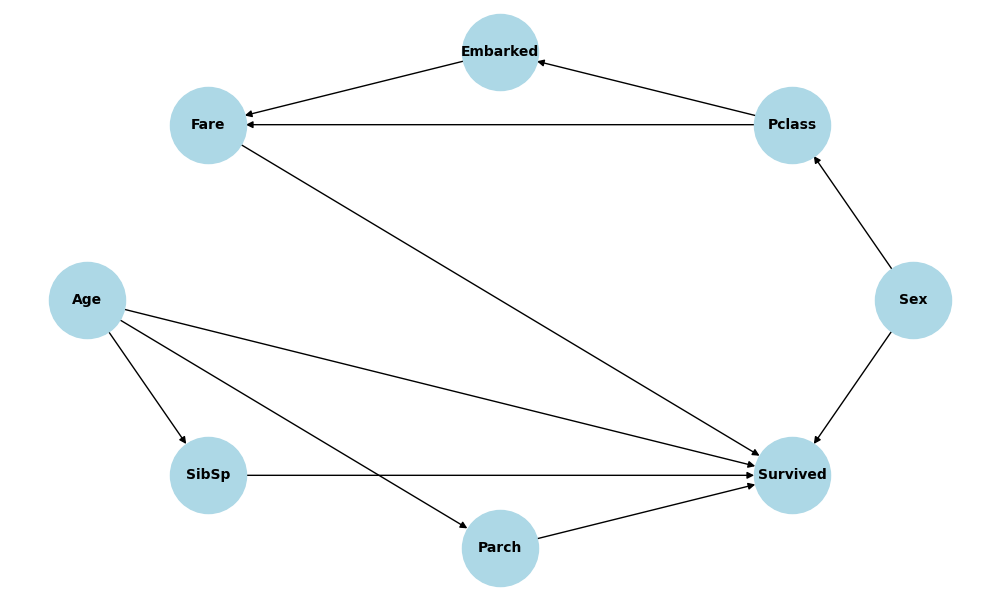
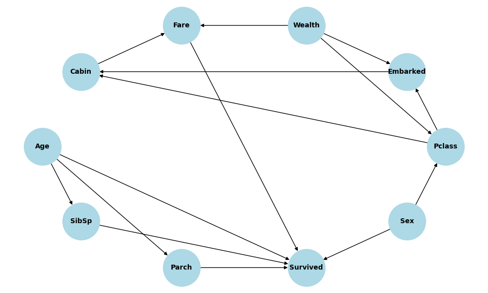

# TeamTanic
Drowning? Couldn't be me

Dataset Source: [https://www.kaggle.com/competitions/titanic/data](https://www.kaggle.com/competitions/titanic/data)

## Maximum Likelihood Estimation

### Generating Missing Data
- `Age`: 177 out of 891 are missing in the training data. We first make a normal distribution with the mean and standard deviation of the rest values we have. To fill the missing values out, we then generate random values from the distribution.
- `Embarked`: There are 2 data point missing embarked, so we randomly assigned one of the three values to them.

> Note:  
> Originally, we also wanted to include `Cabin` as a feature/node in our graph, but since there are too many missing data and the values are sparse, we excluded the node from the graph for MLE.

### Feature Processing
For numerical features, we calculated the histograms and group them into bins instead of using the values directly.
- `Age`: We grouped them with bin size of 5.
- `Fare`: The values are extremely sparse with many outliers, so we binned them into quantile-based grouping (20%, 40%, 60%, 80%).

### MLE Calculation
For root nodes:
$$
P_{\text{ML}}(X_i = x) = \frac{\text{count}(X_i = x)}{T}
$$
For nodes with parents:
$$
P_{\text{ML}}(X_i = x | \text{pa}_i = \pi) = \frac{\text{count}(X_i = x, \text{pa}_i = \pi)}{\text{count}(\text{pa}_i = \pi)}
$$
where $T$ is the number of data points.

### Expectaion-Maximization Algorithm

- E-Step (Inference): Compute posterior probabilities
  - For root nodes:
    $$
    P(X_i=x|V_t=v_t)
    $$
  - For nodes with parents:
    $$
    P(X_i=x, pa_i=\pi|V_t=v_t)
    $$
- M-Step (Learning): Update the CPTs based on the probabilities
  - For root nodes:
    $$
    P(X_i=x) \leftarrow \frac{1}{T} \sum_{t=1}^T P(X_i=x|V_t=v_t)
    $$
  - For nodes with parents:
    $$
    P(X_i=x|pa_i=\pi) \leftarrow \frac{\sum_{t=1}^T P(X_i=x, pa_i=\pi|V_t=v_t)}{\sum_{t=1}^T P(pa_i=\pi|V_t=v_t)}
    $$

To run the following experiments, run `python em.py -e x` where `x` is the case number

1. `Age` hidden, no `Cabin`, randomly generate missing `Embarked`
2. `Age`, `Cabin` hidden, randomly generate missing `Embarked`
3. `Age`, `Cabin`, `Embarked` all hidden